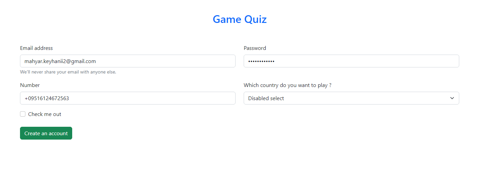

# Game-Quiz-

A quiz game made by React .

All questions are one hundred for now .

First , you should run : <i> npm run server </i> (in terminal) and second run : npm start , and enjoy it ,also you set a localstorage for next time. 

    <h3>Some packages had been useful and necessary </h3>
    <ul>
        <li>Ex React-bootstrap</li>
        <li>Sweetalert</li>
        <li>Axios</li>
        <li>cors</li>
    </ul>

    <h4>Looking around GameQuiz</h4>
    

        

        Sign in GameQuiz
        
        

        

        Playing GameQuiz
        
        

    

